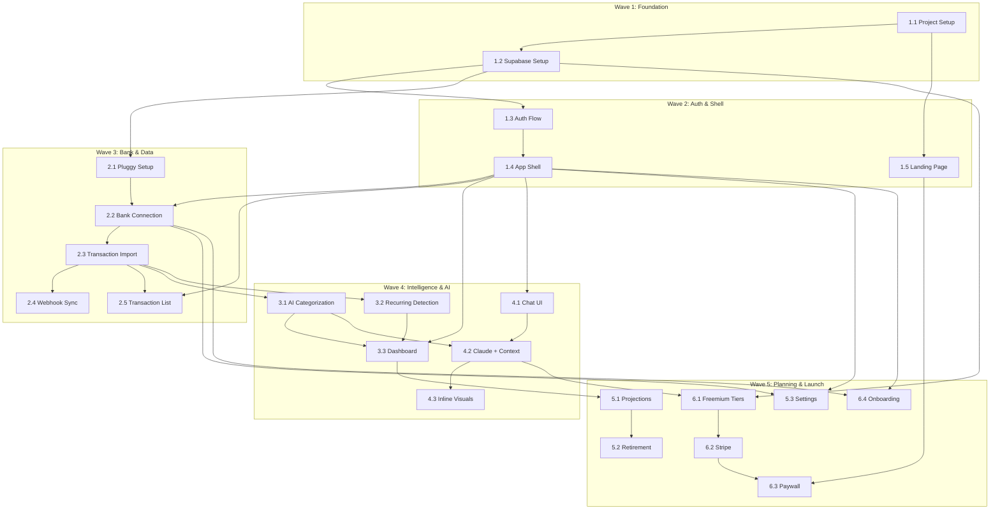

# Cleo — Plano de Implementação

> Plano de execução faseado com dependências, ordem de stories e critérios de gate.

**Version:** 1.0
**Date:** 2026-03-09
**Author:** Aria (Architect Agent)
**Status:** Draft

---

## 1. Visão Geral

O plano segue uma abordagem **incremental por waves**, onde cada wave entrega valor testável e constrói sobre a anterior. As 21 stories dos 6 epics são organizadas em 5 waves baseadas em dependências técnicas e valor de negócio.

### Princípios do Plano

- **Vertical Slices:** Cada wave entrega funcionalidade end-to-end (DB → API → UI)
- **Dependências Explícitas:** Nenhuma story inicia sem suas dependências concluídas
- **Gate entre Waves:** QA gate obrigatório antes de avançar para próxima wave
- **Paralelismo Controlado:** Stories independentes dentro da mesma wave podem ser paralelas

---

## 2. Pré-requisitos (DONE)

| Item | Status | Artefato |
|------|--------|----------|
| PRD completo | DONE | `docs/prd.md` |
| Arquitetura completa | DONE | `docs/architecture/system-architecture.md` |
| Repo GitHub | DONE | `https://github.com/Mercantes/cleo.git` |
| Schema DB no Supabase | DONE | `supabase/migrations/20260309231019_initial_schema.sql` |
| Environment bootstrap | DONE | `.aiox/environment-report.yaml` |

---

## 3. Wave Map

```
Wave 1: Foundation          Stories 1.1, 1.2
Wave 2: Auth & Shell        Stories 1.3, 1.4, 1.5
Wave 3: Bank & Data         Stories 2.1, 2.2, 2.3, 2.4, 2.5
Wave 4: Intelligence & AI   Stories 3.1, 3.2, 3.3, 4.1, 4.2, 4.3
Wave 5: Planning & Launch   Stories 5.1, 5.2, 5.3, 6.1, 6.2, 6.3, 6.4
```

---

## 4. Wave Details

### Wave 1: Foundation (Stories 1.1, 1.2)

**Objetivo:** Scaffold do projeto Next.js e integração com Supabase.

| # | Story | Descrição | Dependências | Paralelizável |
|---|-------|-----------|-------------|---------------|
| 1.1 | Project Setup & Infrastructure | Next.js 14 + TS + Tailwind + shadcn/ui + Vitest | Nenhuma | — |
| 1.2 | Supabase Setup & Database Schema | Supabase client, tipos TS gerados, env vars | 1.1 | Não |

**Notas técnicas:**
- Story 1.2 é parcialmente completa — schema já aplicado no Supabase Cloud. Falta: Supabase client (`client.ts`, `server.ts`), tipos TypeScript gerados, `.env.example`
- Story 1.1 gera a estrutura de diretórios que 1.2 precisa

**Entregável:** Projeto rodando localmente com `npm run dev`, conectado ao Supabase, testes passando.

**Gate:** `npm run lint` + `npm run typecheck` + `npm test` + `npm run build` PASS

---

### Wave 2: Auth & Shell (Stories 1.3, 1.4, 1.5)

**Objetivo:** Autenticação completa, layout da aplicação e landing page.

| # | Story | Descrição | Dependências | Paralelizável |
|---|-------|-----------|-------------|---------------|
| 1.3 | Authentication Flow | Email/senha + Google OAuth + middleware | 1.2 | — |
| 1.4 | App Shell & Layout | Sidebar, bottom nav, header, skeleton states | 1.3 | — |
| 1.5 | Landing Page | Hero, proposta de valor, pricing, SEO | 1.1 | Sim (com 1.3/1.4) |

**Notas técnicas:**
- 1.5 (Landing Page) pode ser desenvolvida em paralelo com 1.3/1.4 pois não depende de autenticação
- 1.3 → 1.4 é sequencial: layout autenticado precisa do middleware de auth
- Google OAuth requer configuração no Supabase Dashboard + credenciais Google Cloud

**Entregável:** Usuário acessa landing page, cadastra-se, faz login e vê o shell da aplicação.

**Gate:** Fluxo completo de signup → login → dashboard → logout testado manualmente + testes automatizados

---

### Wave 3: Bank & Data (Stories 2.1, 2.2, 2.3, 2.4, 2.5)

**Objetivo:** Conexão bancária via Pluggy, importação de transações e visualização.

| # | Story | Descrição | Dependências | Paralelizável |
|---|-------|-----------|-------------|---------------|
| 2.1 | Pluggy Integration Setup | SDK client, API route, env vars | 1.2 | — |
| 2.2 | Bank Connection Flow | Pluggy Connect Widget, salvar conexão | 2.1, 1.4 | — |
| 2.3 | Transaction Import Engine | Buscar transações, deduplicação, progresso | 2.2 | — |
| 2.4 | Webhook Sync | Endpoint webhook, auto-refresh 6h | 2.3 | — |
| 2.5 | Transaction List View | UI de transações, filtros, busca | 2.3, 1.4 | Sim (com 2.4) |

**Notas técnicas:**
- 2.1 → 2.2 → 2.3 → 2.4 é uma cadeia sequencial estrita
- 2.5 (UI) pode ser desenvolvida em paralelo com 2.4 (webhook) — ambas dependem de 2.3
- Tabelas de bank_connections, accounts, transactions, categories já existem no schema
- Precisa: credenciais Pluggy (PLUGGY_CLIENT_ID, PLUGGY_CLIENT_SECRET) — conta sandbox para dev
- Webhook requer URL pública (usar Vercel preview ou ngrok para dev local)

**Entregável:** Usuário conecta banco, vê transações importadas com filtros. Dados sincronizam automaticamente.

**Gate:** Conexão real com banco sandbox + import de transações + webhook funcionando + UI com filtros

---

### Wave 4: Intelligence & AI (Stories 3.1, 3.2, 3.3, 4.1, 4.2, 4.3)

**Objetivo:** Inteligência financeira (categorização, recorrências, dashboard) e chat com IA.

| # | Story | Descrição | Dependências | Paralelizável |
|---|-------|-----------|-------------|---------------|
| 3.1 | AI Categorization | Categorizar transações via Claude Haiku | 2.3 | — |
| 3.2 | Recurring Detection | Detectar assinaturas e parcelas | 2.3 | Sim (com 3.1) |
| 3.3 | Monthly Dashboard | Cards, gráficos, resumo mensal | 3.1, 3.2, 1.4 | — |
| 4.1 | Chat Interface | UI de chat, histórico, responsivo | 1.4 | Sim (com 3.x) |
| 4.2 | Claude API + Context | Streaming SSE, context financeiro, rate limit | 4.1, 3.1 | — |
| 4.3 | Inline Visuals | Gráficos/tabelas dentro do chat | 4.2 | — |

**Notas técnicas:**
- 3.1 e 3.2 são independentes entre si — podem ser paralelas
- 4.1 (Chat UI) é independente do Epic 3 — pode ser paralela com 3.x
- 3.3 (Dashboard) depende de 3.1 + 3.2 (precisa de dados categorizados e recorrências)
- 4.2 depende de 3.1 (context financeiro usa categorias para resumo)
- Claude API: Sonnet para chat, Haiku para categorização batch
- Precisa: ANTHROPIC_API_KEY

**Entregável:** Dashboard com dados reais, chat funcional com contexto financeiro e visuais inline.

**Gate:** Dashboard com dados reais + chat respondendo perguntas financeiras + visuais inline funcionando

---

### Wave 5: Planning & Launch (Stories 5.1-5.3, 6.1-6.4)

**Objetivo:** Projeções financeiras, monetização e polimento para lançamento.

| # | Story | Descrição | Dependências | Paralelizável |
|---|-------|-----------|-------------|---------------|
| 5.1 | Patrimony Projection | Projeção 3/6/12 meses, cenários | 3.3 | — |
| 5.2 | Retirement Estimation | Cálculo aposentadoria, gap analysis | 5.1 | — |
| 5.3 | Financial Settings | Perfil financeiro, bancos conectados | 1.4, 2.2 | Sim (com 5.1) |
| 6.1 | Freemium Tier System | Enforcement de limites Free/Pro | 1.2, 4.2 | Sim (com 5.x) |
| 6.2 | Stripe Integration | Checkout, webhook, cancelamento | 6.1 | — |
| 6.3 | Paywall & Upgrade | Componente paywall, página pricing | 6.2, 1.5 | — |
| 6.4 | Onboarding Polish | Flow step-by-step, progress indicator | 2.2, 1.4 | Sim (com 6.x) |

**Notas técnicas:**
- 5.3 (Settings) pode ser paralela com 5.1/5.2 — apenas depende de layout e dados de conexão
- 6.1 (Tiers) pode ser paralela com 5.x — depende apenas de 1.2 e 4.2
- 6.4 (Onboarding) pode ser paralela com 6.2/6.3 — depende apenas de 2.2 e 1.4
- 5.1 → 5.2 é sequencial (retirement usa projection engine)
- 6.1 → 6.2 → 6.3 é uma cadeia de monetização
- Precisa: Stripe account + STRIPE_SECRET_KEY + STRIPE_WEBHOOK_SECRET + produtos configurados

**Entregável:** Produto completo MVP pronto para lançamento.

**Gate:** Fluxo completo Free → upgrade → Pro funcional + projeções com dados reais + onboarding < 3min

---

## 5. Dependency Graph



---

## 6. Credenciais & Serviços Externos

| Serviço | Variáveis de Ambiente | Quando Necessário | Status |
|---------|----------------------|-------------------|--------|
| **Supabase** | `NEXT_PUBLIC_SUPABASE_URL`, `NEXT_PUBLIC_SUPABASE_ANON_KEY`, `SUPABASE_SERVICE_ROLE_KEY` | Wave 1 (Story 1.2) | Projeto criado |
| **Google OAuth** | Configurar no Supabase Dashboard + Google Cloud Console | Wave 2 (Story 1.3) | Pendente |
| **Pluggy** | `PLUGGY_CLIENT_ID`, `PLUGGY_CLIENT_SECRET` | Wave 3 (Story 2.1) | Pendente |
| **Anthropic** | `ANTHROPIC_API_KEY` | Wave 4 (Story 3.1) | Pendente |
| **Stripe** | `STRIPE_SECRET_KEY`, `STRIPE_PUBLISHABLE_KEY`, `STRIPE_WEBHOOK_SECRET` | Wave 5 (Story 6.2) | Pendente |

---

## 7. Ordem de Execução Recomendada

### Sequência Linear (sem paralelismo)

```
1.1 → 1.2 → 1.3 → 1.4 → 1.5 → 2.1 → 2.2 → 2.3 → 2.4 → 2.5 →
3.1 → 3.2 → 3.3 → 4.1 → 4.2 → 4.3 → 5.1 → 5.2 → 5.3 →
6.1 → 6.2 → 6.3 → 6.4
```

### Sequência Otimizada (com paralelismo)

```
Wave 1: 1.1 → 1.2
Wave 2: 1.3 → 1.4  |  1.5 (paralela)
Wave 3: 2.1 → 2.2 → 2.3 → 2.4  |  2.5 (paralela com 2.4)
Wave 4: 3.1 + 3.2 (paralelas) → 3.3  |  4.1 (paralela) → 4.2 → 4.3
Wave 5: 5.1 → 5.2  |  5.3 (paralela)  |  6.1 → 6.2 → 6.3  |  6.4 (paralela)
```

---

## 8. Riscos por Wave

| Wave | Risco | Mitigação |
|------|-------|-----------|
| Wave 1 | Versão incorreta de dependências | Lock file, engines no package.json |
| Wave 2 | Google OAuth config complexa | Documentar passo-a-passo, testar com conta de teste |
| Wave 3 | Pluggy sandbox limitations | Testar limites da sandbox cedo, mock para dev local |
| Wave 3 | Webhook não funciona local | Usar Vercel preview deploys ou ngrok |
| Wave 4 | Custo inesperado de tokens Claude | Monitor de custo, batch processing, Haiku para categorização |
| Wave 4 | Prompt engineering iterativo | Começar com prompt básico, iterar com dados reais |
| Wave 5 | Stripe webhook reliability | Retry logic, idempotency keys, logging |
| Wave 5 | Edge cases de cálculo financeiro | Testes unitários extensivos para projection engine |

---

## 9. Definition of Done (por Story)

Cada story é considerada "Done" quando:

- [ ] Todos os Acceptance Criteria marcados como completos
- [ ] Testes unitários escritos e passando
- [ ] `npm run lint` PASS
- [ ] `npm run typecheck` PASS
- [ ] `npm run build` PASS
- [ ] Code review (ou CodeRabbit sem CRITICAL issues)
- [ ] Responsividade verificada (mobile + desktop)
- [ ] Story file atualizado com File List e checkboxes

---

## 10. Próximo Passo Imediato

**Iniciar Wave 1 — Story 1.1: Project Setup & Infrastructure**

Ações:
1. `@sm` cria story file detalhado em `docs/stories/1.1.story.md`
2. `@dev` executa scaffold: `npx create-next-app@latest`, Tailwind, shadcn/ui, Vitest
3. `@dev` cria estrutura de diretórios conforme arquitetura
4. `@devops` commit e push após QA gate
