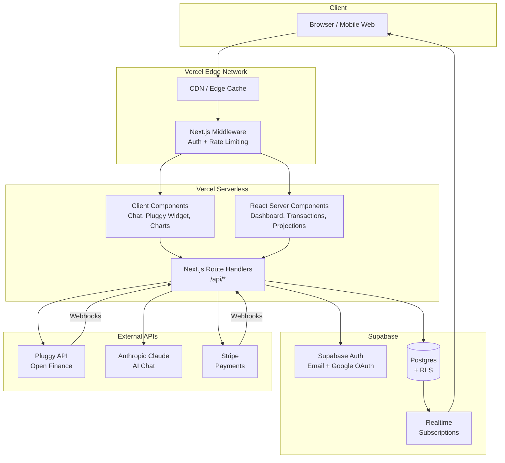
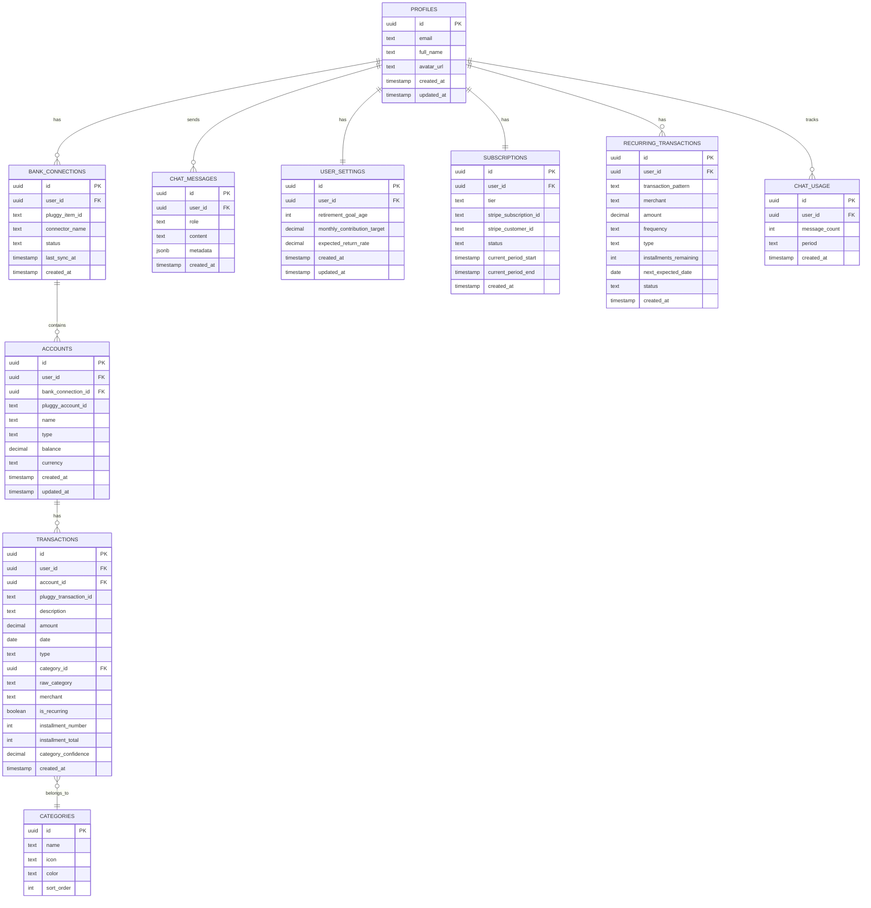
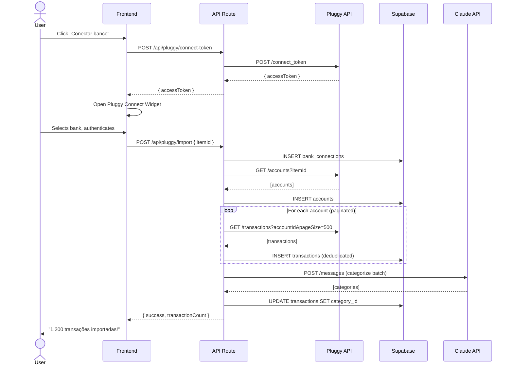
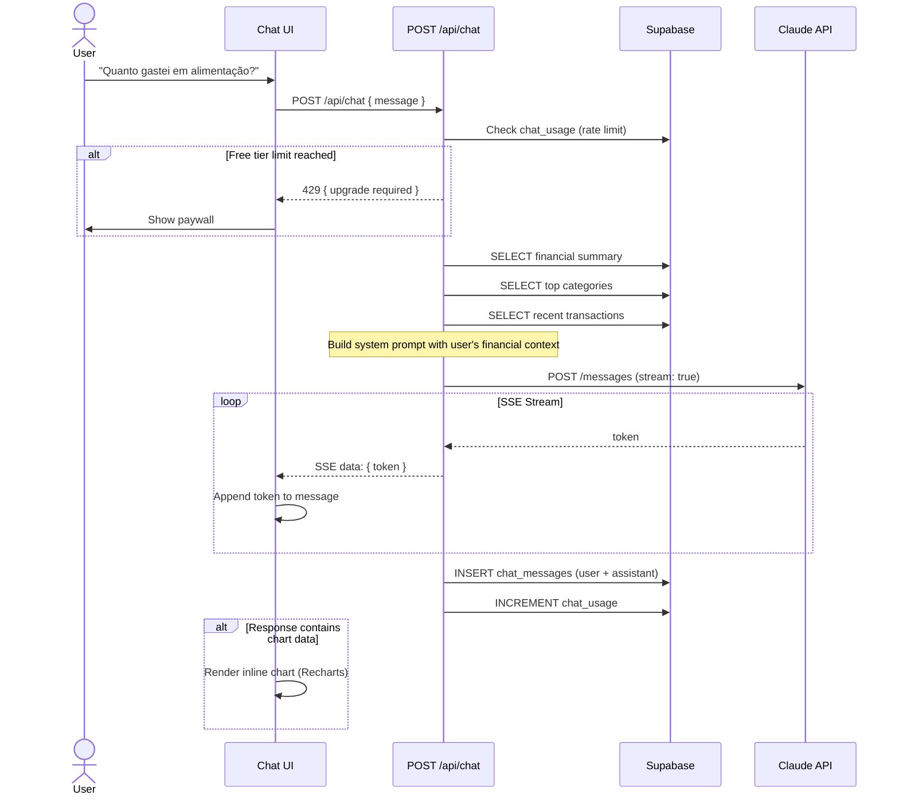
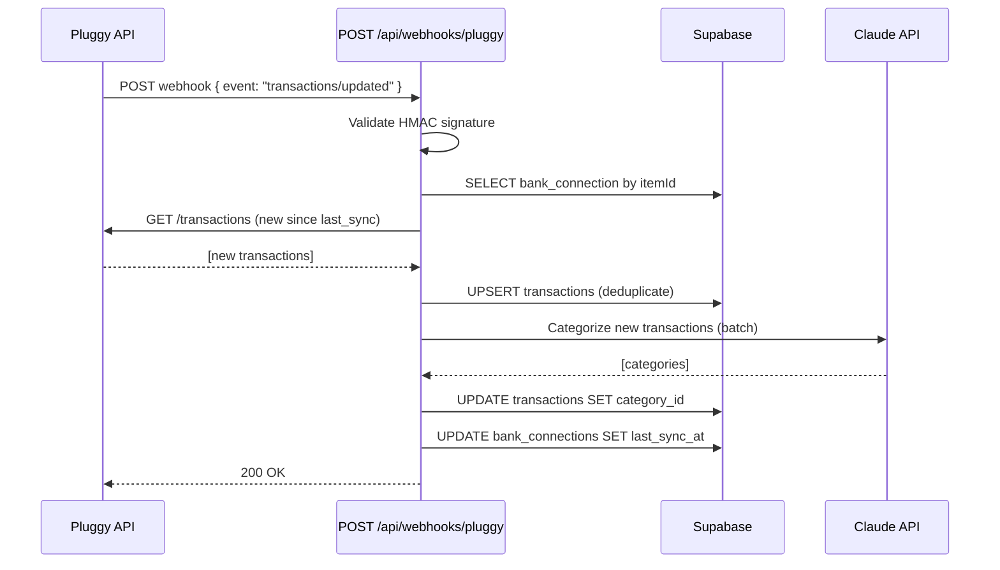
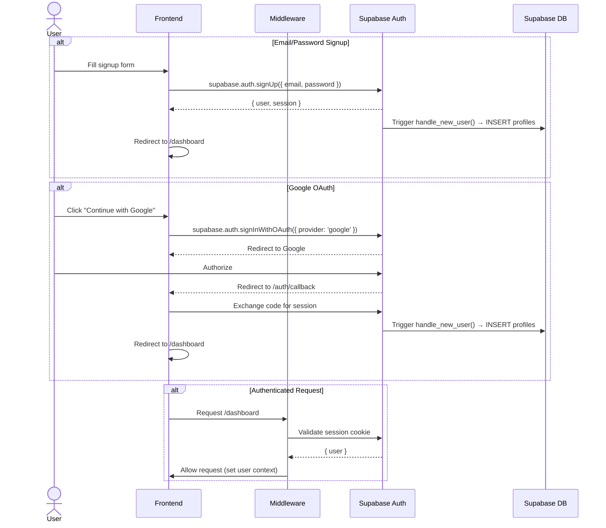

# Cleo — Fullstack Architecture Document

> Arquitetura técnica completa da assistente financeira pessoal com IA

**Version:** 1.0
**Date:** 2026-03-09
**Author:** Aria (Architect Agent)
**Status:** Draft
**Based on:** docs/prd.md v1.0

---

## Change Log

| Date | Version | Description | Author |
|------|---------|-------------|--------|
| 2026-03-09 | 1.0 | Versão inicial da arquitetura | Aria (Architect) |

---

## 1. Introduction

Este documento define a arquitetura full-stack completa da Cleo, uma assistente financeira pessoal com IA para o mercado brasileiro. A arquitetura foi desenhada para suportar o MVP com 6 epics, priorizando velocidade de desenvolvimento, segurança de dados financeiros e escalabilidade progressiva.

**Starter Template:** N/A — Greenfield project com Next.js App Router.

---

## 2. High Level Architecture

### 2.1 Technical Summary

A Cleo utiliza uma arquitetura **Serverless Monolith** baseada em Next.js App Router, onde frontend (React Server Components) e backend (Route Handlers) coexistem no mesmo projeto. O Supabase fornece database (Postgres), autenticação (email + Google OAuth) e Row Level Security como camada de segurança. Três APIs externas são integradas: Pluggy para Open Finance (dados bancários), Anthropic Claude para IA conversacional, e Stripe para pagamentos. O deploy é feito na Vercel com serverless functions, CDN global e preview deployments automáticos.

### 2.2 Platform and Infrastructure

**Platform:** Vercel + Supabase
**Key Services:** Vercel (hosting, serverless, CDN, edge), Supabase (Postgres, Auth, RLS, Realtime, Edge Functions)
**Deployment Regions:** São Paulo (GRU) — Supabase sa-east-1, Vercel auto-edge

**Rationale:** Para um MVP B2C brasileiro, Vercel + Supabase oferece o menor tempo para produção com custos previsíveis. Supabase elimina a necessidade de construir auth, database e real-time do zero. Vercel oferece deploy zero-config para Next.js com CDN global.

### 2.3 Repository Structure

**Structure:** Monorepo (single Next.js project)
**Monorepo Tool:** N/A — Single package, npm workspaces não necessário para MVP
**Package Organization:** Flat structure dentro de `src/`

Rationale: Com Next.js App Router, frontend e API routes vivem no mesmo projeto. A complexidade de monorepo multi-package (Turborepo/Nx) não se justifica para MVP. Quando/se o projeto precisar de mobile app ou microserviços, migrar para Turborepo.

### 2.4 High Level Architecture Diagram



### 2.5 Architectural Patterns

- **Serverless Monolith:** Next.js App Router unifica frontend e backend em deploy serverless — _Rationale:_ Simplicidade operacional para MVP, escala automática, sem servidor para gerenciar
- **React Server Components (RSC):** Rendering no servidor por padrão, client components apenas quando necessário — _Rationale:_ Performance superior, menor JavaScript no client, SEO nativo
- **Repository Pattern (Data Access):** Abstração de acesso ao Supabase via service layer — _Rationale:_ Testabilidade, possibilidade de trocar ORM/database no futuro
- **BFF (Backend for Frontend):** Route Handlers do Next.js servem como BFF — _Rationale:_ API customizada para as necessidades do frontend, sem over-fetching
- **Event-Driven (Webhooks):** Pluggy e Stripe comunicam via webhooks — _Rationale:_ Desacoplamento, processamento assíncrono, confiabilidade
- **Streaming Response:** Chat com IA usa Server-Sent Events (SSE) — _Rationale:_ UX de resposta progressiva, sem WebSocket para MVP

---

## 3. Tech Stack

| Category | Technology | Version | Purpose | Rationale |
|----------|-----------|---------|---------|-----------|
| Language | TypeScript | 5.x | Full-stack type safety | Elimina bugs de tipo, melhor DX, shared types |
| Framework | Next.js | 14+ (App Router) | Full-stack framework | RSC, API routes, SSR, Vercel-native |
| UI Components | shadcn/ui | latest | Component library | Composable, accessible, Tailwind-native |
| Styling | Tailwind CSS | 3.x | Utility-first CSS | Rapid development, consistent design |
| Charts | Recharts | 2.x | Data visualization | React-native, responsive, lightweight |
| State Management | Zustand | 4.x | Client state | Simple API, minimal boilerplate |
| Forms | React Hook Form + Zod | latest | Form handling + validation | Type-safe validation, performant |
| Database | Supabase (Postgres) | latest | Primary datastore | Auth + DB + RLS + Realtime integrado |
| Auth | Supabase Auth | latest | Authentication | Email/senha + Google OAuth, JWT |
| Open Finance | Pluggy API | v1 | Bank connection + transactions | Regulado pelo BC, Connect Widget |
| AI | Anthropic Claude | claude-sonnet-4-20250514 | Chat assistant | Best cost/quality para conversação |
| AI SDK | Vercel AI SDK | latest | Streaming AI responses | Integração nativa Next.js, SSE handling |
| Payments | Stripe | latest | Subscriptions | Webhooks, customer portal, SCA |
| HTTP Client | fetch (native) | - | API calls | Built-in, no extra dependency |
| Date | date-fns | latest | Date manipulation | Tree-shakeable, immutable |
| Unit Testing | Vitest | latest | Unit tests | Fast, ESM-native, Jest-compatible |
| Component Testing | Testing Library | latest | Component tests | User-centric testing |
| E2E Testing | Playwright | latest | End-to-end tests | Cross-browser, reliable |
| Linting | ESLint + Prettier | latest | Code quality | Consistent style, catch errors |
| CI/CD | GitHub Actions | - | Automation | Native GitHub, free for public repos |
| Deploy | Vercel | latest | Hosting | Zero-config Next.js, preview deploys |
| Monitoring | Vercel Analytics + Sentry | latest | Performance + errors | Built-in analytics, error tracking |

---

## 4. Data Models

### 4.1 Entity Relationship Diagram



### 4.2 TypeScript Interfaces

```typescript
// src/types/database.ts — Shared types (gerados via supabase gen types + custom)

export interface Profile {
  id: string;
  email: string;
  full_name: string | null;
  avatar_url: string | null;
  created_at: string;
  updated_at: string;
}

export interface UserSettings {
  id: string;
  user_id: string;
  retirement_goal_age: number | null;
  monthly_contribution_target: number | null;
  expected_return_rate: number | null;
  created_at: string;
  updated_at: string;
}

export interface BankConnection {
  id: string;
  user_id: string;
  pluggy_item_id: string;
  connector_name: string;
  status: 'active' | 'error' | 'outdated' | 'updating';
  last_sync_at: string | null;
  created_at: string;
}

export interface Account {
  id: string;
  user_id: string;
  bank_connection_id: string;
  pluggy_account_id: string;
  name: string;
  type: 'checking' | 'savings' | 'credit';
  balance: number;
  currency: string;
  created_at: string;
  updated_at: string;
}

export interface Transaction {
  id: string;
  user_id: string;
  account_id: string;
  pluggy_transaction_id: string;
  description: string;
  amount: number;
  date: string;
  type: 'debit' | 'credit';
  category_id: string | null;
  raw_category: string | null;
  merchant: string | null;
  is_recurring: boolean;
  installment_number: number | null;
  installment_total: number | null;
  category_confidence: number | null;
  created_at: string;
}

export interface Category {
  id: string;
  name: string;
  icon: string;
  color: string;
  sort_order: number;
}

export interface RecurringTransaction {
  id: string;
  user_id: string;
  transaction_pattern: string;
  merchant: string;
  amount: number;
  frequency: 'monthly' | 'weekly' | 'yearly';
  type: 'subscription' | 'installment';
  installments_remaining: number | null;
  next_expected_date: string | null;
  status: 'active' | 'cancelled' | 'completed';
  created_at: string;
}

export interface Subscription {
  id: string;
  user_id: string;
  tier: 'free' | 'pro';
  stripe_subscription_id: string | null;
  stripe_customer_id: string | null;
  status: 'active' | 'cancelled' | 'past_due' | 'trialing';
  current_period_start: string | null;
  current_period_end: string | null;
  created_at: string;
}

export interface ChatMessage {
  id: string;
  user_id: string;
  role: 'user' | 'assistant';
  content: string;
  metadata: Record<string, unknown> | null;
  created_at: string;
}
```

---

## 5. Database Schema (SQL DDL)

```sql
-- ============================================
-- Cleo Database Schema — Supabase (Postgres)
-- ============================================

-- 1. Categories (seed data, public read)
CREATE TABLE categories (
  id UUID PRIMARY KEY DEFAULT gen_random_uuid(),
  name TEXT NOT NULL UNIQUE,
  icon TEXT NOT NULL DEFAULT '📦',
  color TEXT NOT NULL DEFAULT '#6B7280',
  sort_order INT NOT NULL DEFAULT 0
);

-- Seed categories
INSERT INTO categories (name, icon, color, sort_order) VALUES
  ('Alimentação', '🍔', '#EF4444', 1),
  ('Transporte', '🚗', '#F59E0B', 2),
  ('Moradia', '🏠', '#8B5CF6', 3),
  ('Saúde', '💊', '#10B981', 4),
  ('Educação', '📚', '#3B82F6', 5),
  ('Lazer', '🎮', '#EC4899', 6),
  ('Compras', '🛍️', '#F97316', 7),
  ('Assinaturas', '📺', '#6366F1', 8),
  ('Receita', '💰', '#22C55E', 9),
  ('Transferência', '🔄', '#64748B', 10),
  ('Investimentos', '📈', '#14B8A6', 11),
  ('Outros', '📦', '#6B7280', 99);

-- 2. Profiles (extends auth.users)
CREATE TABLE profiles (
  id UUID PRIMARY KEY REFERENCES auth.users(id) ON DELETE CASCADE,
  email TEXT NOT NULL,
  full_name TEXT,
  avatar_url TEXT,
  created_at TIMESTAMPTZ NOT NULL DEFAULT now(),
  updated_at TIMESTAMPTZ NOT NULL DEFAULT now()
);

-- Auto-create profile on signup
CREATE OR REPLACE FUNCTION handle_new_user()
RETURNS TRIGGER AS $$
BEGIN
  INSERT INTO public.profiles (id, email, full_name, avatar_url)
  VALUES (
    NEW.id,
    NEW.email,
    NEW.raw_user_meta_data->>'full_name',
    NEW.raw_user_meta_data->>'avatar_url'
  );
  RETURN NEW;
END;
$$ LANGUAGE plpgsql SECURITY DEFINER;

CREATE TRIGGER on_auth_user_created
  AFTER INSERT ON auth.users
  FOR EACH ROW EXECUTE FUNCTION handle_new_user();

-- 3. User Settings
CREATE TABLE user_settings (
  id UUID PRIMARY KEY DEFAULT gen_random_uuid(),
  user_id UUID NOT NULL REFERENCES profiles(id) ON DELETE CASCADE UNIQUE,
  retirement_goal_age INT DEFAULT 65,
  monthly_contribution_target DECIMAL(12,2) DEFAULT 0,
  expected_return_rate DECIMAL(5,4) DEFAULT 0.10,
  created_at TIMESTAMPTZ NOT NULL DEFAULT now(),
  updated_at TIMESTAMPTZ NOT NULL DEFAULT now()
);

-- 4. Bank Connections
CREATE TABLE bank_connections (
  id UUID PRIMARY KEY DEFAULT gen_random_uuid(),
  user_id UUID NOT NULL REFERENCES profiles(id) ON DELETE CASCADE,
  pluggy_item_id TEXT NOT NULL UNIQUE,
  connector_name TEXT NOT NULL,
  status TEXT NOT NULL DEFAULT 'active' CHECK (status IN ('active', 'error', 'outdated', 'updating')),
  last_sync_at TIMESTAMPTZ,
  created_at TIMESTAMPTZ NOT NULL DEFAULT now()
);

CREATE INDEX idx_bank_connections_user ON bank_connections(user_id);

-- 5. Accounts
CREATE TABLE accounts (
  id UUID PRIMARY KEY DEFAULT gen_random_uuid(),
  user_id UUID NOT NULL REFERENCES profiles(id) ON DELETE CASCADE,
  bank_connection_id UUID NOT NULL REFERENCES bank_connections(id) ON DELETE CASCADE,
  pluggy_account_id TEXT NOT NULL UNIQUE,
  name TEXT NOT NULL,
  type TEXT NOT NULL CHECK (type IN ('checking', 'savings', 'credit')),
  balance DECIMAL(14,2) NOT NULL DEFAULT 0,
  currency TEXT NOT NULL DEFAULT 'BRL',
  created_at TIMESTAMPTZ NOT NULL DEFAULT now(),
  updated_at TIMESTAMPTZ NOT NULL DEFAULT now()
);

CREATE INDEX idx_accounts_user ON accounts(user_id);

-- 6. Transactions
CREATE TABLE transactions (
  id UUID PRIMARY KEY DEFAULT gen_random_uuid(),
  user_id UUID NOT NULL REFERENCES profiles(id) ON DELETE CASCADE,
  account_id UUID NOT NULL REFERENCES accounts(id) ON DELETE CASCADE,
  pluggy_transaction_id TEXT NOT NULL UNIQUE,
  description TEXT NOT NULL,
  amount DECIMAL(14,2) NOT NULL,
  date DATE NOT NULL,
  type TEXT NOT NULL CHECK (type IN ('debit', 'credit')),
  category_id UUID REFERENCES categories(id),
  raw_category TEXT,
  merchant TEXT,
  is_recurring BOOLEAN NOT NULL DEFAULT false,
  installment_number INT,
  installment_total INT,
  category_confidence DECIMAL(3,2),
  created_at TIMESTAMPTZ NOT NULL DEFAULT now()
);

CREATE INDEX idx_transactions_user_date ON transactions(user_id, date DESC);
CREATE INDEX idx_transactions_account ON transactions(account_id);
CREATE INDEX idx_transactions_category ON transactions(category_id);
CREATE INDEX idx_transactions_pluggy ON transactions(pluggy_transaction_id);

-- 7. Recurring Transactions
CREATE TABLE recurring_transactions (
  id UUID PRIMARY KEY DEFAULT gen_random_uuid(),
  user_id UUID NOT NULL REFERENCES profiles(id) ON DELETE CASCADE,
  transaction_pattern TEXT NOT NULL,
  merchant TEXT NOT NULL,
  amount DECIMAL(14,2) NOT NULL,
  frequency TEXT NOT NULL CHECK (frequency IN ('monthly', 'weekly', 'yearly')),
  type TEXT NOT NULL CHECK (type IN ('subscription', 'installment')),
  installments_remaining INT,
  next_expected_date DATE,
  status TEXT NOT NULL DEFAULT 'active' CHECK (status IN ('active', 'cancelled', 'completed')),
  created_at TIMESTAMPTZ NOT NULL DEFAULT now()
);

CREATE INDEX idx_recurring_user ON recurring_transactions(user_id);

-- 8. Subscriptions (billing)
CREATE TABLE subscriptions (
  id UUID PRIMARY KEY DEFAULT gen_random_uuid(),
  user_id UUID NOT NULL REFERENCES profiles(id) ON DELETE CASCADE UNIQUE,
  tier TEXT NOT NULL DEFAULT 'free' CHECK (tier IN ('free', 'pro')),
  stripe_subscription_id TEXT UNIQUE,
  stripe_customer_id TEXT UNIQUE,
  status TEXT NOT NULL DEFAULT 'active' CHECK (status IN ('active', 'cancelled', 'past_due', 'trialing')),
  current_period_start TIMESTAMPTZ,
  current_period_end TIMESTAMPTZ,
  created_at TIMESTAMPTZ NOT NULL DEFAULT now()
);

-- 9. Chat Messages
CREATE TABLE chat_messages (
  id UUID PRIMARY KEY DEFAULT gen_random_uuid(),
  user_id UUID NOT NULL REFERENCES profiles(id) ON DELETE CASCADE,
  role TEXT NOT NULL CHECK (role IN ('user', 'assistant')),
  content TEXT NOT NULL,
  metadata JSONB,
  created_at TIMESTAMPTZ NOT NULL DEFAULT now()
);

CREATE INDEX idx_chat_user_date ON chat_messages(user_id, created_at DESC);

-- 10. Chat Usage (rate limiting)
CREATE TABLE chat_usage (
  id UUID PRIMARY KEY DEFAULT gen_random_uuid(),
  user_id UUID NOT NULL REFERENCES profiles(id) ON DELETE CASCADE,
  message_count INT NOT NULL DEFAULT 0,
  period TEXT NOT NULL, -- format: '2026-03'
  created_at TIMESTAMPTZ NOT NULL DEFAULT now(),
  UNIQUE(user_id, period)
);

-- ============================================
-- Row Level Security (RLS)
-- ============================================

ALTER TABLE profiles ENABLE ROW LEVEL SECURITY;
ALTER TABLE user_settings ENABLE ROW LEVEL SECURITY;
ALTER TABLE bank_connections ENABLE ROW LEVEL SECURITY;
ALTER TABLE accounts ENABLE ROW LEVEL SECURITY;
ALTER TABLE transactions ENABLE ROW LEVEL SECURITY;
ALTER TABLE recurring_transactions ENABLE ROW LEVEL SECURITY;
ALTER TABLE subscriptions ENABLE ROW LEVEL SECURITY;
ALTER TABLE chat_messages ENABLE ROW LEVEL SECURITY;
ALTER TABLE chat_usage ENABLE ROW LEVEL SECURITY;

-- Categories: public read
ALTER TABLE categories ENABLE ROW LEVEL SECURITY;
CREATE POLICY "Categories are public" ON categories FOR SELECT USING (true);

-- All user tables: users can only access their own data
CREATE POLICY "Users read own profile" ON profiles FOR SELECT USING (auth.uid() = id);
CREATE POLICY "Users update own profile" ON profiles FOR UPDATE USING (auth.uid() = id);

CREATE POLICY "Users manage own settings" ON user_settings FOR ALL USING (auth.uid() = user_id);
CREATE POLICY "Users manage own bank_connections" ON bank_connections FOR ALL USING (auth.uid() = user_id);
CREATE POLICY "Users manage own accounts" ON accounts FOR ALL USING (auth.uid() = user_id);
CREATE POLICY "Users manage own transactions" ON transactions FOR ALL USING (auth.uid() = user_id);
CREATE POLICY "Users manage own recurring" ON recurring_transactions FOR ALL USING (auth.uid() = user_id);
CREATE POLICY "Users manage own subscription" ON subscriptions FOR ALL USING (auth.uid() = user_id);
CREATE POLICY "Users manage own chat" ON chat_messages FOR ALL USING (auth.uid() = user_id);
CREATE POLICY "Users manage own chat_usage" ON chat_usage FOR ALL USING (auth.uid() = user_id);

-- Service role bypass for webhooks (Pluggy, Stripe)
-- Webhooks use supabase service_role key, which bypasses RLS
```

---

## 6. API Specification

### 6.1 Route Handlers (Next.js App Router)

```
src/app/api/
├── auth/
│   └── callback/route.ts          # GET  - OAuth callback (Supabase)
├── pluggy/
│   ├── connect-token/route.ts     # POST - Generate Pluggy Connect token
│   └── import/route.ts            # POST - Trigger transaction import
├── webhooks/
│   ├── pluggy/route.ts            # POST - Pluggy webhook receiver
│   └── stripe/route.ts            # POST - Stripe webhook receiver
├── chat/route.ts                  # POST - Chat with Cleo (streaming SSE)
├── transactions/
│   └── route.ts                   # GET  - List transactions (filtered)
├── dashboard/
│   └── summary/route.ts           # GET  - Monthly financial summary
├── projections/
│   └── route.ts                   # GET  - Patrimony projections
├── categorize/route.ts            # POST - AI categorize transactions batch
├── recurring/route.ts             # GET  - List recurring transactions
└── stripe/
    └── checkout/route.ts          # POST - Create Stripe Checkout session
```

### 6.2 API Endpoints Detail

| Method | Path | Auth | Description | Rate Limit |
|--------|------|------|-------------|------------|
| POST | `/api/pluggy/connect-token` | Yes | Gera token para Pluggy Connect Widget | 10/min |
| POST | `/api/pluggy/import` | Yes | Dispara importação de transações | 2/hour |
| POST | `/api/webhooks/pluggy` | Signature | Recebe webhooks da Pluggy | N/A |
| POST | `/api/webhooks/stripe` | Signature | Recebe webhooks do Stripe | N/A |
| POST | `/api/chat` | Yes | Envia mensagem, retorna stream SSE | Free: 30/mês, Pro: unlimited |
| GET | `/api/transactions?category=&bank=&from=&to=&page=` | Yes | Lista transações com filtros | 60/min |
| GET | `/api/dashboard/summary?month=` | Yes | Resumo financeiro mensal | 30/min |
| GET | `/api/projections?months=3,6,12` | Yes | Projeções de patrimônio | 30/min |
| POST | `/api/categorize` | Yes (service) | Categoriza batch de transações via IA | 5/min |
| GET | `/api/recurring` | Yes | Lista assinaturas e parcelas | 30/min |
| POST | `/api/stripe/checkout` | Yes | Cria sessão de checkout Stripe | 5/min |

---

## 7. External APIs

### 7.1 Pluggy API

- **Purpose:** Conexão de bancos via Open Finance, importação de transações, sync automático
- **Documentation:** https://docs.pluggy.ai
- **Base URL:** `https://api.pluggy.ai`
- **Authentication:** API Key (client_id + client_secret → access_token via `/auth`)
- **Rate Limits:** 100 requests/min por client

**Key Endpoints Used:**
- `POST /auth` — Obter access_token
- `POST /connect_token` — Gerar token para Connect Widget
- `GET /items/{id}` — Status da conexão
- `GET /accounts?itemId={id}` — Listar contas do usuário
- `GET /transactions?accountId={id}&from=&to=&pageSize=500` — Listar transações (paginado)
- Webhook events: `item/updated`, `transactions/updated`

**Integration Notes:** Access token expira em 2h, renovar automaticamente. Transações são paginadas (max 500/page). Webhook deve validar assinatura HMAC.

### 7.2 Anthropic Claude API

- **Purpose:** Chat conversacional com contexto financeiro, categorização de transações
- **Documentation:** https://docs.anthropic.com
- **Base URL:** `https://api.anthropic.com/v1`
- **Authentication:** API Key (header `x-api-key`)
- **Rate Limits:** Tier-dependent (default: 1000 RPM)

**Key Endpoints Used:**
- `POST /messages` — Chat completion (streaming via SSE)

**Integration Notes:** Usar Vercel AI SDK para streaming. Model: `claude-sonnet-4-20250514` para chat (custo/qualidade), `claude-haiku-4-5-20251001` para categorização (custo). System prompt inclui contexto financeiro real do usuário. Max tokens: 1024 para chat, 256 para categorização.

### 7.3 Stripe API

- **Purpose:** Processamento de pagamentos, gestão de assinaturas
- **Documentation:** https://docs.stripe.com
- **Base URL:** `https://api.stripe.com/v1`
- **Authentication:** API Key (header `Authorization: Bearer sk_...`)
- **Rate Limits:** 100 reads/sec, 25 writes/sec

**Key Endpoints Used:**
- `POST /checkout/sessions` — Criar sessão de checkout
- `POST /billing_portal/sessions` — Customer portal
- Webhook events: `checkout.session.completed`, `invoice.paid`, `customer.subscription.deleted`, `invoice.payment_failed`

**Integration Notes:** Usar Stripe SDK oficial. Webhooks validam assinatura com `stripe.webhooks.constructEvent()`. Dois Price IDs: monthly (R$ 19,90) e yearly (R$ 179).

---

## 8. Core Workflows

### 8.1 Bank Connection & Transaction Import



### 8.2 Chat with Cleo (Streaming)



### 8.3 Webhook Sync (Pluggy)



---

## 9. Unified Project Structure

```
cleo/
├── .github/
│   └── workflows/
│       ├── ci.yml                    # Lint + typecheck + test on PR
│       └── preview.yml               # Preview deploy on PR (Vercel auto)
├── src/
│   ├── app/                          # Next.js App Router
│   │   ├── (auth)/                   # Auth group (no layout)
│   │   │   ├── login/page.tsx
│   │   │   ├── signup/page.tsx
│   │   │   └── auth/callback/route.ts
│   │   ├── (app)/                    # Authenticated app group
│   │   │   ├── layout.tsx            # App shell (sidebar + nav)
│   │   │   ├── dashboard/page.tsx
│   │   │   ├── chat/page.tsx
│   │   │   ├── transactions/page.tsx
│   │   │   ├── projections/page.tsx
│   │   │   ├── subscriptions/page.tsx
│   │   │   └── settings/page.tsx
│   │   ├── (marketing)/              # Public pages
│   │   │   ├── layout.tsx
│   │   │   ├── page.tsx              # Landing page
│   │   │   └── pricing/page.tsx
│   │   ├── api/                      # Route Handlers
│   │   │   ├── chat/route.ts
│   │   │   ├── pluggy/
│   │   │   │   ├── connect-token/route.ts
│   │   │   │   └── import/route.ts
│   │   │   ├── webhooks/
│   │   │   │   ├── pluggy/route.ts
│   │   │   │   └── stripe/route.ts
│   │   │   ├── transactions/route.ts
│   │   │   ├── dashboard/summary/route.ts
│   │   │   ├── projections/route.ts
│   │   │   ├── categorize/route.ts
│   │   │   ├── recurring/route.ts
│   │   │   └── stripe/checkout/route.ts
│   │   ├── layout.tsx                # Root layout
│   │   └── globals.css
│   ├── components/
│   │   ├── ui/                       # shadcn/ui components
│   │   ├── chat/
│   │   │   ├── chat-interface.tsx
│   │   │   ├── chat-message.tsx
│   │   │   ├── chat-visual.tsx       # Inline charts
│   │   │   └── chat-suggestions.tsx
│   │   ├── dashboard/
│   │   │   ├── summary-cards.tsx
│   │   │   ├── category-chart.tsx
│   │   │   └── monthly-comparison.tsx
│   │   ├── transactions/
│   │   │   ├── transaction-list.tsx
│   │   │   └── transaction-filters.tsx
│   │   ├── projections/
│   │   │   ├── projection-chart.tsx
│   │   │   └── retirement-card.tsx
│   │   ├── bank/
│   │   │   ├── pluggy-connect.tsx
│   │   │   └── bank-status.tsx
│   │   ├── paywall/
│   │   │   ├── paywall-modal.tsx
│   │   │   └── pricing-table.tsx
│   │   ├── onboarding/
│   │   │   └── onboarding-flow.tsx
│   │   └── layout/
│   │       ├── app-sidebar.tsx
│   │       ├── bottom-nav.tsx
│   │       └── header.tsx
│   ├── lib/
│   │   ├── supabase/
│   │   │   ├── client.ts             # Browser client
│   │   │   ├── server.ts             # Server client (cookies)
│   │   │   ├── middleware.ts          # Auth middleware helper
│   │   │   └── admin.ts              # Service role client (webhooks)
│   │   ├── pluggy/
│   │   │   ├── client.ts             # Pluggy API client
│   │   │   └── sync.ts               # Transaction sync logic
│   │   ├── ai/
│   │   │   ├── chat.ts               # Chat with Claude (streaming)
│   │   │   ├── categorizer.ts        # Transaction categorization
│   │   │   └── prompts.ts            # System prompts
│   │   ├── stripe/
│   │   │   ├── client.ts             # Stripe client
│   │   │   └── webhooks.ts           # Webhook handler
│   │   ├── finance/
│   │   │   ├── projection-engine.ts  # Patrimony projections
│   │   │   ├── recurring-detector.ts # Subscription/installment detection
│   │   │   └── summary.ts            # Monthly summary calculations
│   │   └── utils/
│   │       ├── format.ts             # Currency, date formatting
│   │       ├── constants.ts          # App constants
│   │       └── rate-limit.ts         # Rate limiting helper
│   ├── stores/
│   │   ├── auth-store.ts             # Auth state (Zustand)
│   │   └── chat-store.ts             # Chat state (Zustand)
│   ├── types/
│   │   ├── database.ts               # DB types (generated + custom)
│   │   ├── api.ts                    # API request/response types
│   │   └── chart.ts                  # Chart data types
│   └── hooks/
│       ├── use-auth.ts
│       ├── use-transactions.ts
│       ├── use-dashboard.ts
│       └── use-chat.ts
├── tests/
│   ├── unit/
│   │   ├── finance/
│   │   │   ├── projection-engine.test.ts
│   │   │   ├── recurring-detector.test.ts
│   │   │   └── summary.test.ts
│   │   └── ai/
│   │       └── categorizer.test.ts
│   ├── integration/
│   │   └── components/
│   │       ├── dashboard.test.tsx
│   │       └── chat.test.tsx
│   └── e2e/
│       ├── onboarding.spec.ts
│       ├── chat.spec.ts
│       └── transactions.spec.ts
├── supabase/
│   ├── migrations/
│   │   └── 001_initial_schema.sql
│   ├── seed.sql
│   └── config.toml
├── docs/
│   ├── prd.md
│   ├── architecture/
│   │   └── system-architecture.md
│   └── stories/
├── public/
│   ├── favicon.ico
│   └── og-image.png
├── .env.example
├── .gitignore
├── next.config.ts
├── tailwind.config.ts
├── tsconfig.json
├── vitest.config.ts
├── playwright.config.ts
├── package.json
└── README.md
```

---

## 10. Frontend Architecture

### 10.1 Component Organization

- **`components/ui/`** — shadcn/ui primitives (Button, Input, Card, Dialog, etc.)
- **`components/{feature}/`** — Feature-specific composites (chat, dashboard, etc.)
- **`components/layout/`** — App shell, navigation

Convention: Cada component é um arquivo `.tsx`. Sem barrel exports (`index.ts`). Import direto.

### 10.2 State Management (Zustand)

```typescript
// src/stores/auth-store.ts
import { create } from 'zustand';
import type { Profile, Subscription } from '@/types/database';

interface AuthState {
  user: Profile | null;
  subscription: Subscription | null;
  isLoading: boolean;
  setUser: (user: Profile | null) => void;
  setSubscription: (sub: Subscription | null) => void;
  isPro: () => boolean;
}

export const useAuthStore = create<AuthState>((set, get) => ({
  user: null,
  subscription: null,
  isLoading: true,
  setUser: (user) => set({ user, isLoading: false }),
  setSubscription: (subscription) => set({ subscription }),
  isPro: () => get().subscription?.tier === 'pro',
}));
```

**Patterns:**
- Server state (transactions, dashboard): React Server Components + `fetch` (no client state needed)
- Client state (chat messages, UI state): Zustand stores
- Form state: React Hook Form (local to component)
- Auth state: Zustand + Supabase `onAuthStateChange`

### 10.3 Routing Architecture (Next.js App Router)

```
Route Groups:
├── (marketing)/ → Public pages, no auth required
│   ├── /            → Landing page
│   └── /pricing     → Pricing page
├── (auth)/        → Auth pages, redirect if logged in
│   ├── /login
│   └── /signup
└── (app)/         → Authenticated app, redirect to /login if not authed
    ├── /dashboard
    ├── /chat
    ├── /transactions
    ├── /projections
    ├── /subscriptions
    └── /settings
```

### 10.4 Protected Route Pattern

```typescript
// src/app/(app)/layout.tsx
import { redirect } from 'next/navigation';
import { createServerClient } from '@/lib/supabase/server';

export default async function AppLayout({ children }: { children: React.ReactNode }) {
  const supabase = await createServerClient();
  const { data: { user } } = await supabase.auth.getUser();

  if (!user) {
    redirect('/login');
  }

  return (
    <div className="flex h-screen">
      <AppSidebar />
      <main className="flex-1 overflow-auto">{children}</main>
      <BottomNav className="md:hidden" />
    </div>
  );
}
```

### 10.5 Frontend Services Layer

```typescript
// src/lib/supabase/server.ts
import { createServerClient as createClient } from '@supabase/ssr';
import { cookies } from 'next/headers';

export async function createServerClient() {
  const cookieStore = await cookies();
  return createClient(
    process.env.NEXT_PUBLIC_SUPABASE_URL!,
    process.env.NEXT_PUBLIC_SUPABASE_ANON_KEY!,
    {
      cookies: {
        getAll: () => cookieStore.getAll(),
        setAll: (cookiesToSet) => {
          cookiesToSet.forEach(({ name, value, options }) =>
            cookieStore.set(name, value, options)
          );
        },
      },
    }
  );
}
```

---

## 11. Backend Architecture

### 11.1 Route Handler Pattern

```typescript
// src/app/api/transactions/route.ts
import { NextRequest, NextResponse } from 'next/server';
import { createServerClient } from '@/lib/supabase/server';

export async function GET(request: NextRequest) {
  const supabase = await createServerClient();
  const { data: { user } } = await supabase.auth.getUser();

  if (!user) {
    return NextResponse.json({ error: 'Unauthorized' }, { status: 401 });
  }

  const { searchParams } = request.nextUrl;
  const category = searchParams.get('category');
  const from = searchParams.get('from');
  const to = searchParams.get('to');
  const page = parseInt(searchParams.get('page') || '1');
  const pageSize = 50;

  let query = supabase
    .from('transactions')
    .select('*, categories(*)')
    .eq('user_id', user.id)
    .order('date', { ascending: false })
    .range((page - 1) * pageSize, page * pageSize - 1);

  if (category) query = query.eq('category_id', category);
  if (from) query = query.gte('date', from);
  if (to) query = query.lte('date', to);

  const { data, error } = await query;

  if (error) {
    return NextResponse.json({ error: error.message }, { status: 500 });
  }

  return NextResponse.json({ data, page, pageSize });
}
```

### 11.2 Authentication Flow



### 11.3 Auth Middleware

```typescript
// src/middleware.ts
import { NextResponse } from 'next/server';
import type { NextRequest } from 'next/server';
import { createServerClient } from '@supabase/ssr';

export async function middleware(request: NextRequest) {
  const response = NextResponse.next();

  const supabase = createServerClient(
    process.env.NEXT_PUBLIC_SUPABASE_URL!,
    process.env.NEXT_PUBLIC_SUPABASE_ANON_KEY!,
    {
      cookies: {
        getAll: () => request.cookies.getAll(),
        setAll: (cookiesToSet) => {
          cookiesToSet.forEach(({ name, value, options }) => {
            response.cookies.set(name, value, options);
          });
        },
      },
    }
  );

  const { data: { user } } = await supabase.auth.getUser();

  // Protected routes
  if (request.nextUrl.pathname.startsWith('/(app)') ||
      request.nextUrl.pathname.match(/^\/(dashboard|chat|transactions|projections|settings)/)) {
    if (!user) {
      return NextResponse.redirect(new URL('/login', request.url));
    }
  }

  // Auth routes - redirect if logged in
  if (request.nextUrl.pathname.match(/^\/(login|signup)/) && user) {
    return NextResponse.redirect(new URL('/dashboard', request.url));
  }

  return response;
}

export const config = {
  matcher: ['/((?!_next/static|_next/image|favicon.ico|api/webhooks).*)'],
};
```

---

## 12. Security Architecture

### 12.1 Security Layers

| Layer | Mechanism | Implementation |
|-------|-----------|---------------|
| **Transport** | TLS 1.3 | Vercel automatic HTTPS |
| **Authentication** | JWT (Supabase) | httpOnly cookies, refresh rotation |
| **Authorization** | RLS (Postgres) | Per-table policies, `auth.uid()` |
| **API Protection** | Rate Limiting | Middleware + chat_usage table |
| **Webhook Security** | HMAC Signature | Pluggy + Stripe signature validation |
| **Data at Rest** | AES-256 | Supabase encryption (managed) |
| **Secrets** | Env Vars | Vercel environment variables, never client-side |
| **Input Validation** | Zod | All API inputs validated with schemas |
| **XSS Prevention** | React + CSP | React auto-escaping + Content-Security-Policy |
| **CORS** | Next.js Config | API routes only accept same-origin |

### 12.2 Sensitive Data Handling

- **Pluggy tokens:** Stored server-side only, never exposed to frontend. `client_secret` in env vars.
- **Stripe keys:** `sk_*` server-side only. `pk_*` public (checkout only).
- **Claude API key:** Server-side only, in env vars.
- **User financial data:** Protected by RLS. No local storage of sensitive data. No logging of transaction details.
- **LGPD Compliance:** Consentimento no signup, botão "Deletar conta" executa cascade delete (profiles → all user data).

### 12.3 Rate Limiting

```typescript
// src/lib/utils/rate-limit.ts
import { createServerClient } from '@/lib/supabase/server';

export async function checkChatRateLimit(userId: string): Promise<{
  allowed: boolean;
  remaining: number;
  limit: number;
}> {
  const supabase = await createServerClient();
  const period = new Date().toISOString().slice(0, 7); // '2026-03'

  // Get user tier
  const { data: sub } = await supabase
    .from('subscriptions')
    .select('tier')
    .eq('user_id', userId)
    .single();

  const limit = sub?.tier === 'pro' ? Infinity : 30;

  // Get current usage
  const { data: usage } = await supabase
    .from('chat_usage')
    .select('message_count')
    .eq('user_id', userId)
    .eq('period', period)
    .single();

  const count = usage?.message_count || 0;
  return {
    allowed: count < limit,
    remaining: Math.max(0, limit - count),
    limit,
  };
}
```

---

## 13. Deployment Architecture

### 13.1 Strategy

**Frontend + Backend:** Vercel (unified deploy)
- Build: `next build`
- Output: Static + Serverless Functions
- CDN: Vercel Edge Network (global)
- Preview: Automatic per PR

**Database:** Supabase Cloud (sa-east-1, São Paulo)

### 13.2 Environments

| Environment | URL | Database | Purpose |
|-------------|-----|----------|---------|
| Development | `localhost:3000` | Supabase local (`supabase start`) | Dev local |
| Preview | `cleo-*.vercel.app` | Supabase staging project | PR review |
| Production | `cleo.app` (TBD) | Supabase production project | Live |

### 13.3 Environment Variables

```bash
# .env.example

# Supabase
NEXT_PUBLIC_SUPABASE_URL=https://xxx.supabase.co
NEXT_PUBLIC_SUPABASE_ANON_KEY=eyJ...
SUPABASE_SERVICE_ROLE_KEY=eyJ...

# Pluggy
PLUGGY_CLIENT_ID=xxx
PLUGGY_CLIENT_SECRET=xxx
PLUGGY_WEBHOOK_SECRET=xxx

# Anthropic
ANTHROPIC_API_KEY=sk-ant-xxx

# Stripe
NEXT_PUBLIC_STRIPE_PUBLISHABLE_KEY=pk_live_xxx
STRIPE_SECRET_KEY=sk_live_xxx
STRIPE_WEBHOOK_SECRET=whsec_xxx
STRIPE_PRICE_MONTHLY=price_xxx
STRIPE_PRICE_YEARLY=price_xxx

# App
NEXT_PUBLIC_APP_URL=https://cleo.app
```

### 13.4 CI/CD Pipeline

```yaml
# .github/workflows/ci.yml
name: CI
on:
  pull_request:
    branches: [main]

jobs:
  quality:
    runs-on: ubuntu-latest
    steps:
      - uses: actions/checkout@v4
      - uses: actions/setup-node@v4
        with: { node-version: 22 }
      - run: npm ci
      - run: npm run lint
      - run: npm run typecheck
      - run: npm run test -- --coverage
      - run: npm run build
```

---

## 14. Performance Optimization

### Frontend
- **Bundle Size Target:** < 200KB gzipped (initial load)
- **Loading:** React Server Components by default, client components lazy-loaded
- **Images:** Next.js `<Image>` with automatic optimization
- **Caching:** Vercel ISR for landing page, dynamic for app pages

### Backend
- **Response Time Target:** < 200ms (API), < 5s (chat streaming first token)
- **Database:** Indexes on all foreign keys + `(user_id, date DESC)` for transactions
- **AI Cost:** Batch categorization (50 tx/request), cache financial summary per day
- **Webhook Processing:** < 30s target, async transaction import

---

## 15. Testing Strategy

### Testing Pyramid

```
         E2E (Playwright)
        /  3 critical flows  \
      Integration (Testing Library)
     / Component render + interaction \
   Unit Tests (Vitest)
  / Finance logic, AI prompts, utils  \
```

### Coverage Targets
- **Unit (finance logic):** > 80%
- **Integration (components):** > 60%
- **E2E (critical flows):** Onboarding, Chat, Upgrade

---

## 16. Error Handling

### API Error Format

```typescript
interface ApiError {
  error: {
    code: string;        // 'RATE_LIMIT_EXCEEDED' | 'UNAUTHORIZED' | etc.
    message: string;     // User-friendly message
    details?: unknown;   // Debug info (dev only)
  };
}
```

### Error Codes

| Code | HTTP | Description |
|------|------|-------------|
| `UNAUTHORIZED` | 401 | User not authenticated |
| `FORBIDDEN` | 403 | User lacks permission |
| `RATE_LIMIT_EXCEEDED` | 429 | Chat or API rate limit hit |
| `PLUGGY_ERROR` | 502 | Pluggy API failure |
| `AI_ERROR` | 502 | Claude API failure |
| `STRIPE_ERROR` | 502 | Stripe API failure |
| `VALIDATION_ERROR` | 400 | Invalid input (Zod) |
| `INTERNAL_ERROR` | 500 | Unexpected server error |

---

## 17. Monitoring & Observability

| Concern | Tool | Purpose |
|---------|------|---------|
| Performance | Vercel Analytics | Core Web Vitals, page load times |
| Errors | Sentry | Error tracking, stack traces |
| AI Cost | Custom logging | Tokens consumed per user per month |
| Uptime | Vercel + Supabase | Built-in monitoring |
| Database | Supabase Dashboard | Query performance, connection pool |

---

## 18. Coding Standards

### Critical Rules

- **Absolute Imports:** Always use `@/` prefix (e.g., `@/lib/supabase/server`)
- **Server vs Client:** Default to Server Components. Add `'use client'` only when needed (interactivity, hooks, browser APIs)
- **API Calls from Server:** Use Supabase server client directly in Server Components. No `/api` routes for server-side data fetching.
- **API Calls from Client:** Use Route Handlers (`/api/*`) for mutations and streaming
- **Error Handling:** All Route Handlers must try/catch and return structured ApiError
- **Env Vars:** Never access `process.env` directly in client code. Only `NEXT_PUBLIC_*` vars are client-safe.
- **Financial Calculations:** Always use integer cents internally, format to BRL only for display
- **RLS Trust:** Never filter by `user_id` manually in queries — RLS enforces it. But always pass auth context.

### Naming Conventions

| Element | Convention | Example |
|---------|-----------|---------|
| Components | PascalCase | `SummaryCards.tsx` |
| Hooks | camelCase with `use` | `useAuth.ts` |
| Lib/Services | kebab-case | `projection-engine.ts` |
| API Routes | kebab-case dirs | `/api/connect-token/route.ts` |
| DB Tables | snake_case | `bank_connections` |
| DB Columns | snake_case | `last_sync_at` |
| Types | PascalCase | `BankConnection` |
| Constants | UPPER_SNAKE | `MAX_FREE_MESSAGES` |

---

## 19. Next Steps

### For @data-engineer
> Revise o database schema (Seção 5) e valide: indexes, RLS policies, performance de queries para dashboard e transações com alto volume. Considere partitioning para transactions se > 1M rows/user.

### For @dev
> Use este documento como referência para implementação. Comece pela Story 1.1 (Project Setup). A estrutura de diretórios (Seção 9) e os patterns (Seção 10-11) são o guia definitivo.

### For @ux-design-expert
> Crie wireframes baseados nas Core Screens (PRD 6.3) e na estrutura de componentes (Seção 9). O layout responsivo com sidebar + bottom nav está definido na Seção 10.4.
